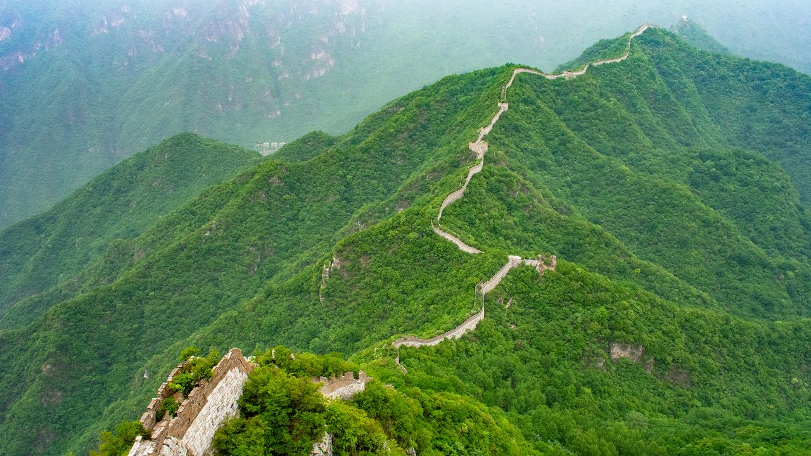

# China's remote and dangerous Great Wall

The Great Wall of China, which winds for 21,000km across the north of the country, is one of humanity’s most renowned creations. It has been listed as one of the “new” Seven Wonders of the World alongside the Taj Mahal and the Colosseum. It was named a Unesco World Heritage site in 1987. When tourists come to Beijing, they head by busload to the wall’s most famous outposts. 

Few of them come here.

The Jiankou section of the wall ribbons over the top of jagged green mountains for 20km. From the valley below, it looks like icing piped onto each peak.

It is located just 100km north of Beijing. But it is completely different from its better-known neighbours, like Badaling or Mutianyu. There is no souvenir shop or Starbucks, no cable car or gondola. No one is waiting to sell you tickets. No one is there to make your visit easier, either: to access this section of the wall, you must hike 45 minutes up a mountain.

And there was – until recently – no restoration. Built in the 1500s and early 1600s, this section was left untouched for centuries. Around seven kilometres of it fared especially badly. Over time, the towers melted into mounds of rubble. Some parts of the wall tumbled down completely, rendering once-wide sections so narrow that only one person could walk at a time. Trees and bushes pushed through the ground, making the wall look more forest than fortification.

The lack of work on the wall made it picturesque, but dangerous. “Every year, maybe one or two people die hiking on this part of the wall,” said Ma Yao, project manager of the Great Wall Protection Project at Tencent Charity Foundation, which funded the latest repair. “Some from hiking and falling down, dead. And some from being hit by lightning. 
On a sunny spring day towards the project’s end, I sat on the wall with Ma. We were surrounded by fortification-topped peaks as far as the eye could see. “You can see the mountains here. The machines can’t come here. We have to use people,” he told me. “But we should use technologies to help these people to do this work better.”

For the 2019 phase of the project, that technology included drones, 3D mapping and a computer algorithm that could tell engineers whether they had to remove that tree or fix this crack – or whether they could safely leave them as they were, reminders of when the wall had once been wild.
