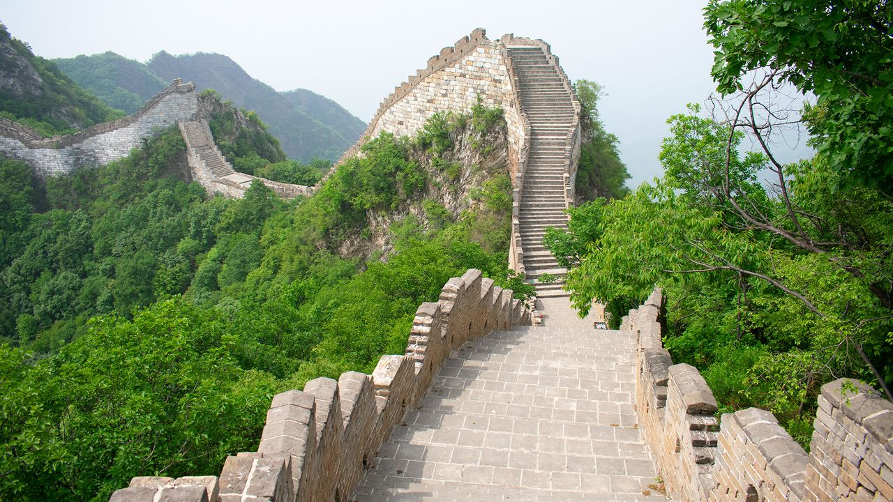
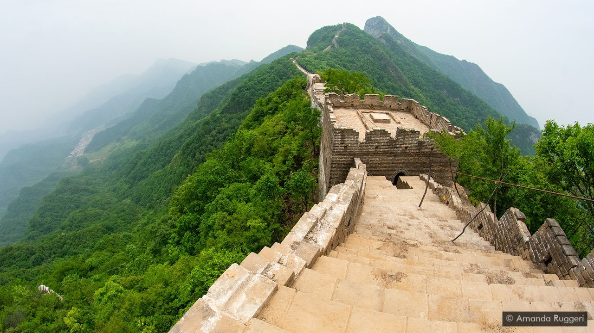

# China's remote and dangerous Great Wall

The Great Wall of China, which winds for 21,000km across the north of the country, is one of humanity’s most renowned creations. It has been listed as one of the “new” Seven Wonders of the World alongside the Taj Mahal and the Colosseum. It was named a Unesco World Heritage site in 1987. When tourists come to Beijing, they head by busload to the wall’s most famous outposts. 

Few of them come here.

The Jiankou section of the wall ribbons over the top of jagged green mountains for 20km. From the valley below, it looks like icing piped onto each peak.

It is located just 100km north of Beijing. But it is completely different from its better-known neighbours, like Badaling or Mutianyu. There is no souvenir shop or Starbucks, no cable car or gondola. No one is waiting to sell you tickets. No one is there to make your visit easier, either: to access this section of the wall, you must hike 45 minutes up a mountain.

And there was – until recently – no restoration. Built in the 1500s and early 1600s, this section was left untouched for centuries. Around seven kilometres of it fared especially badly. Over time, the towers melted into mounds of rubble. Some parts of the wall tumbled down completely, rendering once-wide sections so narrow that only one person could walk at a time. Trees and bushes pushed through the ground, making the wall look more forest than fortification.

The lack of work on the wall made it picturesque, but dangerous. “Every year, maybe one or two people die hiking on this part of the wall,” said Ma Yao, project manager of the Great Wall Protection Project at Tencent Charity Foundation, which funded the latest repair. “Some from hiking and falling down, dead. And some from being hit by lightning. 
On a sunny spring day towards the project’s end, I sat on the wall with Ma. We were surrounded by fortification-topped peaks as far as the eye could see. “You can see the mountains here. The machines can’t come here. We have to use people,” he told me. “But we should use technologies to help these people to do this work better.”

For the 2019 phase of the project, that technology included drones, 3D mapping and a computer algorithm that could tell engineers whether they had to remove that tree or fix this crack – or whether they could safely leave them as they were, reminders of when the wall had once been wild.

“Just over the hill there are 20 million people,” said historian and conservationist William Lindesay, referring to Beijing. “So, the ‘leave nothing but footprints’ [advice] – even footprints can actually damage the wall.”

Lindesay has devoted his life to researching, writing about and fighting for conservation of the wall. Originally from England, Lindesay saw it on a map as a boy in 1967 and decided he had to explore it. In 1987, three years after a run of Hadrian’s Wall that inspired him to revive his childhood fascination, he walked the Great Wall on foot. He was the first foreigner to walk the Ming wall from end to end, an undertaking he did again, albeit by Jeep, in 2016. “It wasn’t this scenic footslog. I was stopped by the police nine times – you could call them arrests,” he told me. “I was eventually charged with repeated trespassing in closed areas and I was deported. So, I went to Hong Kong and [was later able to come back in]. I had the physical adventure, the political adventure – and I made three proposals of marriage to the same girl, so I had the romantic adventure.”
He also fell in love with the Jiankou wall: the contrast of the grey fortifications against the green mountains; the trees growing through the bricks. He moved to the foot of Jiankou with his family in 1997 and coined the term “wild wall” to describe the difference between a spot like Jiankou and the reconstructed, touristed sections like Badaling. “The wild wall – and there are thousands of kilometres of it – actually constitutes the world’s greatest open-air museum,” he said.

No one seemed bothered by the two white signs with crisp red strokes that said, in Mandarin, “NO TOURISTS”. Technically, the wall isn’t officially “open” to the public, although no one can clarify exactly what that means, or explain why other signs aimed at tourists dot the hiking path.

With the restoration finished, it’s likely that this tranquillity will change. The “NO TOURIST” signs probably will, too. There will be less fear of the wild wall. More and more people will come, not only the most intrepid.

The wall may be less derelict and dangerous than it once was. But it remains a striking reminder of the centuries that shaped not only the fortification, but China itself. And its spirit, if a wall can have a spirit, still has whispers of wild.

